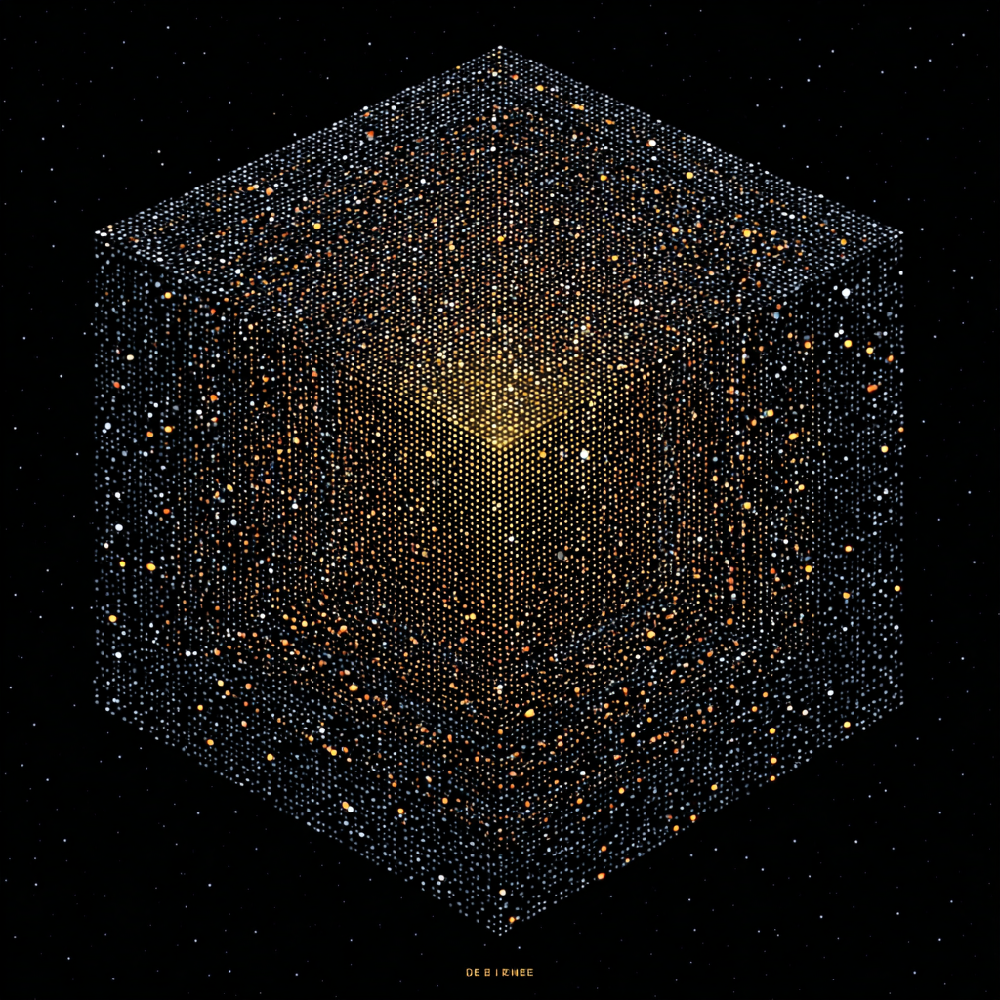

<p align="center">
  
</p>

# VSF (Versatile Serial Format)

A self-describing binary format designed for optimal integer encoding and type safety.

VSF addresses a fundamental challenge in binary formats: how to efficiently encode integers of any size while maintaining O(1) skip-ability. The solution enables efficient storage of everything from a single photon's wavelength to the number of atoms in the observable universe (and yes, both fit comfortably).

**📚 [Full Documentation & Examples](https://holdmyoscilloscope.com/vsf/)**

---

## Core Innovation: Exponential-Width Integer Encoding

Most binary formats face a tradeoff when encoding integers:

**Fixed-width approach** (TIFF, PNG, HDF5):
- Fast to parse (known size)
- Wastes space on small values
- Hard limits (4GB for u32, etc.)

**Variable-width approach** (Protobuf, MessagePack):
- Compact encoding (7 bits per byte, continuation bit in MSB)
- **Cannot skip** - must read every byte to find the end (O(n) parse cost)
- Caps at 64 bits (Protobuf stops at 2^64-1, MessagePack at 2^64-1)
- Can't encode "Planck volumes in observable universe" (~10^185)

**VSF's solution** - Exponential-width with explicit size markers:

```
Value 42:                'u' '3' 0x2A              (2 decimal digits)
Value 4,096:             'u' '4' 0x10 0x00         (4 digits)
Value 2^32-1:            'u' '5' + 4 bytes         (10 digits)
Value 2^64-1:            'u' '6' + 8 bytes         (20 digits)
Value 2^128-1:           'u' '7' + 16 bytes        (39 digits)
Value 2^256-1:           'u' '8' + 32 bytes        (78 digits)
RSA-16384 prime:         'u' 'D' + 2048 bytes      (4932 digits)
Actual max:              'u' 'Z' + 8 GB            (~20 billion digits)
```

**Properties:**
- ✅ O(1) skip - read single byte exponent, immediately skip that number of bytes
- ✅ Optimal size - automatically selects minimal encoding
- ✅ No hard limits - can encode all arbitrarily large values (assuming you have the storage)
- ✅ 40-70% space savings vs fixed-width on typical data

---

## Why VSF Has Literally No Limits (Unlike Every Other Format)

### The Universal Integer Encoding Problem

Every binary format faces this question: **"How do you encode a number when you don't know how big it will be?"**

Until VSF, every format in existence picked one of these three bad answers:

**Answer 0: "We'll use fixed sizes"** (TIFF, PNG, HDF5)
- Store everything as u32 or u64
- **Problem**: Hits hard limits (4GB for u32) and wastes space for small numbers

**Answer 1: "We'll use continuation bits"** (Protobuf, MessagePack)
- 7 bits per byte, MSB indicates "more bytes follow"
- **Problem**: Must read every byte to find the end (literally cannot skip), hard cap at 64 bits for native integers

**Answer 2: "We'll store the length first"** (Most TLV formats)
- Store length as u32, then data
- **Problem**: Length field itself has a limit! Recursion required for bigger lengths, small numbers waste space

### VSF's Answer: Exponential Width Encoding (EWE)

VSF introduces **Exponential Width Encoding (EWE)** - a novel byte-aligned scheme where ASCII markers map directly to exponential size classes:

```
How it works:
0. Type: 'u' (unsigned), 'i' (signed), etc.
1. Size: ASCII character '0'-'Z'
2. Data: Exactly 2^(ASCII) bits follow
3. 0=bool, 3=8 bits, 4=16 bits, 5=32 bits, 6=64 bits, ..., Z=2^36 bits (8 GB)

Example: 'u' '5' [0x01234567]
          │   │  └─ Data (2^5 bits = 32 bits = 4 bytes)
          │   └─ Size class marker
          └─ Type marker

Result: O(1) seekability + unbounded integers
```

**Why this works:**

Every number can be represented as `mantissa × 2^exponent`:
- **Small numbers** → small exponents → small markers ('3', '4')
- **Large numbers** → large exponents → large markers ('D', 'Z')
- **The ASCII marker IS the exponent** (directly encoded, no recursion needed)

**Novel properties of EWE:**
- **Byte-aligned** - no bit-shifting, works with standard I/O
- **O(1) seekability** - read one marker (two bytes), know exact size
- **ASCII-readable** - markers are printable characters for debugging
- **Unbounded** - bool to 8 GB (that's a HUGE number!)

### Overhead Analysis: From Tiny to Googolplex

Let's look at what it costs to encode numbers of different magnitudes:
```
Value 42:           2 bytes overhead + 1 byte data = 3 bytes total
Value 2^64-1:       2 bytes overhead + 8 bytes data = 10 bytes total
RSA-16384 prime:    2 bytes overhead + 2048 bytes = 2050 bytes total
```

**The overhead stays negligible even for numbers larger than the universe.**

### Comparison: What CAN'T Other Formats Handle?

Here are real-world numbers that **break** other formats but VSF handles trivially:

#### Protobuf/MessagePack: Caps at 2^64-1
```
❌ Planck volumes in observable universe: ~10^185
   (Needs 185 bits, Protobuf stops at 64)

✅ VSF: 'u' 'B' + 23 bytes = 25 bytes total
```

#### JSON: Precision loss above 2^53
```
❌ Cryptographic keys (RSA-16384 = 2048 bytes)
   JSON can't represent integers > 2^53 exactly

✅ VSF: 'u' 'D' + 2048 bytes = 2050 bytes
```

#### HDF5: 64-bit everywhere!
```
❌ Storing 1 million boolean flags as u64
   Wastes 8 MB instead of 125 KB

✅ VSF bitpacked: 125KB (1000x smaller)
```

### Theoretical Limits: Universe Runs Out First

With marker 'Z' (ASCII 90), VSF can encode:
```
2^(2^36) = 2^68,719,476,736 possible values

That's a memory address with ~20.7 billion digits!

For context:
- Atoms in universe: ~10^80 (needs 266 bits)
- Planck volumes in universe: ~10^185 (needs 615 bits)

VSF handles all of these with **two bytes of overhead.**
```

**You will run out of storage, memory, and life WAY before VSF hits any limits.**

### Why This Matters: Future-Proof Architecture

Today's "unreasonably large" is tomorrow's "barely sufficient":

**1970s**: "640KB ought to be enough for anybody"
**1990s**: "Why would anyone need more than 4GB?" (u32 addresses)
**2010s**: "2^64 is effectively infinite" (IPv6, filesystems)
**2020s**: Quantum computing, cosmological simulations, genomic databases hitting 2^64 limits

**VSF's design principle**: Stop predicting the future. Build a format that **mathematically cannot** impose artificial limits.

### The Core Innovation

VSF is the only format that combines:
- **Optimal space efficiency** (no wasted bits on small numbers)
- **Arbitrary size support** (no maximum value)
- **O(1) seekability** (know size without parsing)
- **Byte-aligned** (no bit-shifting overhead)

This is possible because I solved the fundamental problem: **How do you easily encode the exponent of arbitrarily large numbers?**

Answer: **Directly**, using ASCII characters as exponential size class markers (Exponential Width Encoding).

Every other format either:
0. Uses fixed exponents (hits limits, wastes space on small numbers), or
1. Uses variable exponents but can't encode their length efficiently (not seekable), or
2. Doesn't try at all (caps at 64 bits)

---

## Type Tag Overloading Specification

Every VSF value on the wire is: `⦉letter(s)⦊⦉size⦊⦉data⦊` — always, no exceptions.

The letter(s) identify the type. How many letters, and which kind, determines what you're looking at:

```
⦉single char⦊              → primitive
  n  b  z  y  m  e  x  l  o  d  ...

⦉char⦊⦉size digit⦊         → sized variant of that primitive
  u3  u6  f5  f6  i4  s44  c55  ...

⦉char⦊⦉lowercase letter⦊   → named family member
  hp  hb  ge  ke  na  nh  wa  ...
```

### Why these three classes never collide

The second character always falls into exactly one of three non-overlapping ASCII ranges:

| Class | Characters | ASCII range | Meaning |
|-------|-----------|-------------|---------|
| Digit | `0`–`9` | 0x30–0x39 | size exponent (base36 low) |
| Uppercase | `A`–`Z` | 0x41–0x5A | size exponent (base36 high) |
| Lowercase | `a`–`z` | 0x61–0x7A | named family member |

A parser reads the second byte and immediately knows which case it's in. No lookahead, no ambiguity.

### Size digits mean 2^N bits

The size digit is a **base36 number** — digits `0`–`9` have values 0–9, letters `A`–`Z` have values 10–35. The value of that digit is N, and the type holds **2^N bits**:

```
u0 = 2^0 =   1 bit   (bool)
u3 = 2^3 =   8 bits  (u8)
u4 = 2^4 =  16 bits  (u16)
u5 = 2^5 =  32 bits  (u32)
u6 = 2^6 =  64 bits  (u64)
u7 = 2^7 = 128 bits  (u128)
u8 = 2^8 = 256 bits
u9 = 2^9 = 512 bits
uA = 2^10 = 1024 bits   (A = 10 in base36)
uZ = 2^35 bits          (Z = 35 in base36 — larger than you will ever need)
```

Same rule applies to every primitive: `f5` = 2^5 = 32-bit float, `f6` = 2^6 = 64-bit float, `s44` = Spirix scalar with 2^4=16-bit fraction and 2^4=16-bit exponent, and so on.

The second-character class is unambiguous at the byte level — `0x30`–`0x5A` is size, `0x61`–`0x7A` is family. These ranges do not overlap.

### Type Families

| Prefix | Family | Members |
|--------|--------|---------|
| `h`    | Hash | `hp` `hb` `hs` `hm` `hg` `hc` `hk` |
| `g`    | Signature | `ge` `gp` `gd` `gs` `gf` |
| `k`    | Key    | `ke` `kx` `kp` `kc` `ka` ... |
| `ks`   | Shared secret | `ksx` `ksp` `ksk` ... |
| `m`    | MAC    | `mh` `mp` `mb` `mc` |
| `l`    | Length in bytes (wire or file) — replaces uppercase `L` |  |
| `a`    | ASCII text | `a"hello"` (replaces `l` for ASCII strings) |
| `u`    | Unit quantity | `u[group][unit][type]` — e.g. `ulmf6`=meters f64, `ufnf5`=newtons f32 |
| `r`    | Colour/raster | `re` `ru` `ra` `rf` ... |
| `rc`   | Named colour | `rcr` `rcg` `rcb` `rcw` ... |
| `ro`   | Drawable object | `rob` `roc` `rol` `rop` ... |
| `na`   | Network address | scheme + host + optional port |
| `nh`   | Network host | bare hostname or IP string |
| `ni`   | Network IPv4 | 4 bytes |
| `nj`   | Network IPv6 | 16 bytes |
| `nc`   | Network CIDR | address + prefix length |
| `nm`   | Network MAC  | 6 bytes |
| `np`   | Network port | standalone port number |
| `ns`   | Network socket | host + port, no scheme |
| `nu`   | Network URL  | full URL including path/query |
| `nn`   | Network name | DNS name, validated format |

### `na` Scheme Enum

| Value | Scheme |
|-------|--------|
| 0 | https |
| 1 | http |
| 2 | ftp |
| 3 | sftp |
| 4 | ssh |
| 5 | ntp |
| 6 | smtp |
| 7 | ws |
| 8 | wss |

### Length, ASCII, and MAC reorganisation (v0.3.5)

Three letters were re-aligned to give every spec primitive an obvious mnemonic:

- **`l`** is now **length** (wire or file). Replaces uppercase `L`, which broke the lowercase-only rule.
- **`a`** is now **ASCII text**. Old wire tag `l` for ASCII is gone — `a` reads naturally.
- **`m*`** is now the **MAC family** (`mh` `mp` `mb` `mc`). Old `a*` MACs (`ah` `ap` `ab` `ac`) are gone.

Toka marker types (`m(usize)` definition + `r + usize` reference) are removed; use `hp` provenance hashes for stable references instead.

---

## Type Safety Thru Exhaustive Pattern Matching

VSF is written entirely in Rust with zero wildcards in all match statements:

```rust
match self {
    VsfType::u0(value) => encode_bool(value),
    VsfType::u3(value) => encode_u8(value),
    VsfType::u4(value) => encode_u16(value),
    // ... 208 more explicit cases ...
    VsfType::p(tensor) => encode_bitpacked(tensor),
}
// No _ => I forgot?
```

**Why this matters:**
- Add a type? Won't compile until handled everywhere
- Remove a type? Compiler shows all affected code
- Refactor? Guided thru every impact
- Ship unhandled cases? Not possible

**Why Rust specifically?** It's the only language that gives you proven:
- Memory safety **without** garbage collection
- Thread safety **without** runtime checks
- Zero-cost abstractions (no interpreter, no VM, no GC pauses)
- **All enforced at compile time**

This isn't possible in any other language:
- C/C++: Manual memory (use-after-free, double-free, null pointers)
- Java/C#/Go/Python/JS: Garbage collection (pauses, unpredictability)
- Everything else: Pick your poison ☠️

**Ways VSF can break:**
0. **Cosmic rays** (hardware bit flips) → Use ECC RAM, hash check will fail
1. **Python FFI** → Just don't. Spirix bans it anyway
2. **You modify the code** → Compiler catches it before you ship

That's it. Those are the **only** ways VSF breaks. Everything else is systematically impossible! Cool eh?

---

## What VSF Enables

### 0. Efficient Bitpacked Tensors

Camera RAW data, scientific sensors, and ML models often use non-standard bit depths:

```rust
// 12-bit camera RAW (common in photography)
BitPackedTensor {
    shape: vec![4096, 3072],  // 12.6 megapixels
    bit_depth: 12,
    data: packed_bytes,
}
// 18 MB vs 24 MB as a sixteen bit array
```

Supports 1-256 bits per element efficiently.

### 1. Cryptographic Primitives as Types

Hashes, signatures, and keys are first-class types:

```rust
VsfType::a(algorithm, mac_tag)    // Message Authentication Code
VsfType::h(algorithm, hash)       // Hash (BLAKE3, SHA-256, etc.)
VsfType::g(algorithm, signature)  // Signature (Ed25519, ECDSA, RSA)
VsfType::k(algorithm, pubkey)     // Public key
```

### 2. Two's Complement Floating-Point (Spirix Integration)

VSF natively supports Spirix - two's complement floating-point as an alternative to IEEE-754:

```rust
VsfType::s53(spirix_scalar)  // 32-bit fraction, 8-bit exponent Scalar (F5E3)
VsfType::c64(spirix_circle)  // 64-bit fractions, 16-bit exponent Circle (complex numbers!)
```

**Why Spirix exists:** IEEE-754 breaks fundamental math:
- NaN (wat)
- Two different zeros: +0 and -0 (but +0 == -0 returns true?!)
- Very small numbers underflow to zero, breaking *a × b = 0 iff a = 0 or b = 0*
- Infinity from overflow, not just division by zero
- Sign-magnitude representation requires special-case branching EVERYWHERE!

**What Spirix fixes:**
- **One Zero.** Not two. Just one. I don't remember there ever being two zeros in math class?
- **One Infinity.** Reserved for actual mathematical singularities (like 1/0), not overflow
- **Vanished values** - numbers too small to represent normally but **not zero** (preserves sign/orientation)
- **Exploded values** - numbers too large to represent but **not infinite** (preserves sign/orientation)
- **Two's complement thruout** - no sign bit shenanigans, no special cases
- **a × b = 0 iff a = 0 or b = 0** - all the time, every time, 100% of the time
- **Customizable precision AND range** - pick your fraction and exponent sizes independently! (F3E3 to F7E7)

**Undefined states that actually tell you what went wrong:**
Instead of IEEE's generic NaN, Spirix tracks *why* something became undefined:
- `[℘ ⬆+⬆]` - You added two exploded values (whoops!)
- `[℘ ⬇/⬇]` - You divided two vanished values
- `[℘ ⬆×⬇]` - Multiplied infinity by Zero?
- Dozens more - your debugger will thank you!

VSF stores all 25 Scalar types (F3-F7 × E3-E7) and 25 Circle types as first-class primitives.

### 3. Geographic Precision (Dymaxion WorldCoord)

Store Earth coordinates with millimeter precision:

```rust
VsfType::w(WorldCoord::from_lat_lon(47.6062, -122.3321))
```

Uses Fuller's Dymaxion projection - 2.14mm precision in 8 bytes.

### 4. Huffman-Compressed Text

Unicode strings with global frequency table:

```rust
VsfType::x(text)  // Automatically compressed
// ~36% compression on English text
// 83 MB/s encode, 100+ MB/s decode 2025 average CPU
```

---

## Comparison with Other Formats

### TIFF
- **Strength**: Widely supported, good for images
- **Limitation**: 4GB file limit (u32 offsets), 12 bytes minimum overhead per tag
- **VSF approach**: Variable-width encoding, no size limits

### PNG
- **Strength**: Lossless compression, ubiquitous
- **Limitation**: 12 bytes per chunk overhead, u32 length limits
- **VSF approach**: Minimal overhead per field, arbitrary sizes

### HDF5
- **Strength**: Hierarchical data, scientific community adoption
- **Limitation**: Complex spec, u64 everywhere wastes space
- **VSF approach**: Optimal size selection, simpler spec

### Protobuf
- **Strength**: Cross-language, schema evolution
- **Limitation**: Varint requires sequential parsing (O(n) skip)
- **VSF approach**: O(1) skip with explicit size markers

### JSON
- **Strength**: Human-readable, debuggable, universal
- **Limitation**: Text encoding bloat, precision loss, no binary data
- **VSF approach**: Binary format, full precision, efficient

---

### Working Now

✅ **Pretty damn complete type system** - 211 variants:
- Primitives: u3-u7 (8-128 bit), i3-i7 (signed), f5-f6 (float), j5-j6 (complex)
- Spirix: 50 types (25 Scalar + 25 Circle varieties)
- Tensors: 130 flavors (65 contiguous + 65 strided)
- Bitpacked: 1-256 bit bins
- Metadata: strings, time, hashes, signatures, keys, MACs

✅ **Encoding/decoding**
- Full round-trip validation
- Variable-length integer encoding
- Big-endian byte order

✅ **Huffman text compression** (requires `text` feature)
- Global Unicode frequency table
- 36% compression typical, not just English
- Low overhead
- Enable with: `cargo build --features text`
- Without feature: use `VsfType::a` for ASCII text instead of `VsfType::x`

✅ **Cryptographic support** (requires `crypto` feature)
- Hash algorithms: BLAKE3 (default), SHA-256, SHA-512
- Signatures: Ed25519, ECDSA-P256, RSA-2048
- Keys: Ed25519, X25519, P-256, RSA-2048
- MACs: HMAC-SHA256/512, Poly1305, BLAKE3-keyed, CMAC
- **Mandatory file hash integrity** - automatic on every build

✅ **Camera RAW builders**
- Extensive metadata support (CFA pattern, black/white levels, etc.)
- Calibration frame hashes with algorithm IDs
- Camera settings (ISO, shutter, aperture, focal length)
- Lens metadata (make, model, focal range, aperture range)

✅ **Builder pattern with dot notation**
- Ergonomic field access: `raw.camera.iso_speed = Some(800.0)`
- Nested builders for organized metadata
- Already implemented and working

✅ **Zero-copy mmap support**
- BitPackedTensor data is raw bytes after header
- Parse `'p' [bit_depth] [ndim] [shapes...]` then mmap the data
- No "unboxed sections" needed - bulk data types are already mmap-able

✅ **Hierarchical field names**
- Section names support dots: `"camera.sensor"`, `"raw.calibration"`, etc.
- Validation enforces clean syntax (no leading/trailing dots, no double dots)
- Already implemented - use `builder.add_section("camera.sensor", items)`

✅ **Type-safe schema system**
- Pattern-based TypeConstraint validation (no type system duplication)
- Named field encoding with d-type keys: `(d"field_name":value)`
- Automatic type conversion via IntoVsfType/FromVsfType traits
- Parse → modify → re-encode workflow
- Official schemas: image, camera, audio, network_peer, announce
- See [schema/README.md](src/schema/README.md) for examples

✅ **Two-tier parsing API**
- **Low-level** (`VsfSection::parse`): Schema-agnostic, extracts raw data, no validation
- **High-level** (`SectionBuilder::parse`): Schema-validated, type-safe, modify→re-encode workflow
- Both parse the same binary format; high-level adds enforcement layer
- See "Parsing APIs" section below for details

### Released in v0.3.0

✅ **Opcode type** - Added `VsfType::op` for executable bytecode
✅ **Literal VSF format** - `vsfinfo` now displays 1:1 file representation
✅ **Proper bracket notation** - `⦉⦊` for values, `{}` for opcodes
✅ **G^0* base notation** - Hexadecimal with proper base prefix (replaces 0x)
✅ **Eagle Time precision** - Fixed millisecond calculation from oscillation counts

### Coming Next (v0.4.0)

🚧 **Structured capability tokens** - Formal capability types built on existing crypto primitives (`g`, `k`, `h`, `a`)

**Note on File I/O:** VSF gives you bytes - do whatever you want with them:
```rust
let bytes = encode(&my_data)?;
std::fs::write("data.vsf", &bytes)?;  // Or network, database, embedded, etc.
```
File I/O is intentionally out of scope - you know your use case better than we do. Network streaming? Memory-mapped regions? SQLite blobs? Custom compression? VSF doesn't make opinions about your storage layer

---

## Versioning: The Crate Tracks the Wire

From 0.8.0 forward, **the crate minor IS the format version**: vsf 0.8.x writes z8 files, vsf 0.9.x will write z9, always.
Any breaking change — wire or API — bumps both together, so the version string is the dialect declaration.
The backward-compat floor (`y`) lives in every file header and is enforced by the reader, not encoded in the crate version: a build rejects files older than its floor by name ("file is v7, this build reads v8+") instead of misparsing them.

**The 0.6 lane (`0.6.42`) is special: it is the frozen encoder lane for [ihi](https://crates.io/crates/ihi).**
It is byte-identical code to 0.8.0, published under a version ihi can pin (`vsf = "0.6"`) so the identity-critical `x` text encoder (NFC normalization + full-codespace Huffman) can never move underneath handle-proof derivation while the main lane iterates.
It also structurally breaks the historical vsf↔ihi dependency cycle: `vsf 0.8 + handle → ihi → vsf 0.6` resolves as two coexisting copies instead of a cycle error.
Do not pin `"0.6"` unless you are ihi — everyone else uses the latest main lane.
The lane changes only for coordinated encoder emergencies (0.6.43+), never routinely.

History and the yank policy: 0.4.0/0.4.1 are yanked (encode-side NFC bug — wrote wrong bytes into the world; encode corruption gets yanked).
0.4.2 and 0.5.0 remain as superseded history (decode-side x bug under `text-encode`-only builds — misread valid files but never wrote a bad byte; decode bugs get superseded, not yanked).
The z7 era shipped two wire breaks without version bumps; `tests/frozen_wire.rs` pins the exact v8 bytes of `x`/`a`/`d` so that can never happen silently again.

---

## Quick Start

```rust
use vsf::{VsfType, BitPackedTensor, Tensor};

// Store 12-bit camera RAW
let raw = BitPackedTensor::pack(12, vec![4096, 3072], &pixel_data);
let encoded = VsfType::p(raw).flatten();

// Store a tensor (8-bit grayscale image)
let tensor = Tensor::new(vec![1920, 1080], grayscale_data);
let img = VsfType::t_u3(tensor);

// Store text (automatically Huffman compressed)
let doc = VsfType::x("Hello, world!".to_string());

// Store a hash (BLAKE3)
use vsf::crypto_algorithms::HASH_BLAKE3;
let hash = VsfType::h(HASH3, hash_bytes);

// Round-trip
let decoded = VsfType::parse(&encoded)?;
assert_eq!(original, decoded);
```

### Feature Flags

VSF uses optional features to keep the default build minimal:

```toml
[dependencies]
vsf = "0.8"                    # Core only (no optional features)
vsf = { version = "0.8", features = ["text-encode"] }  # + Huffman text (x type)
vsf = { version = "0.8", features = ["text"] }    # umbrella: inspect + text-encode + clap (NOT handle)
vsf = { version = "0.8", features = ["crypto"] }  # + Ed25519, X25519, AES-GCM
vsf = { version = "0.8", features = ["spirix"] }  # + Spirix arithmetic
vsf = { version = "0.8", features = ["handle"] }  # + vsf::handle shim (pulls ihi)
```

| Feature | Enables | Use Case |
|---------|---------|----------|
| (none) | Core types, tensors, encoding/decoding | Basic serialization |
| `text` | `VsfType::x` Huffman-compressed strings | Human-readable text storage |
| `crypto` | Ed25519 signatures, X25519 key exchange, AES-GCM | Signed/encrypted data |
| `spirix` | Spirix two's-complement floats (`s33`-`s77`, `c33`-`c77`) | Two's complement floating-point |

**Note:** Without `text`, use `VsfType::a` for ASCII text. Without `crypto`, hash types (`h`) still work (BLAKE3 is always available), but signatures (`g`) and encryption require the feature.

### Parsing APIs: Two Tiers

VSF provides two approaches to parsing sections, each suited to different use cases:

#### Low-Level: `VsfSection::parse()`

Schema-agnostic parsing that extracts raw data without validation. Located in `src/file_format.rs`.

```rust
use vsf::VsfSection;

let mut ptr = 0;
let section = VsfSection::parse(&bytes, &mut ptr)?;
// Returns VsfSection { name: String, fields: Vec<VsfField> }
// No schema required, no validation performed
// Caller controls pointer position (useful for streaming)
```

**Use when:**
- Reading unknown/arbitrary VSF data
- Debugging or inspecting files
- Building tooling that handles any section type
- You don't have or need a schema

#### High-Level: `SectionBuilder::parse()`

Schema-validated parsing for type-safe workflows. Located in `src/schema/section.rs`.

```rust
use vsf::schema::{SectionSchema, SectionBuilder, TypeConstraint};

// Define expected structure
let schema = SectionSchema::new("camera")
    .field("iso", TypeConstraint::AnyUnsigned)
    .field("shutter", TypeConstraint::AnyFloat)
    .field("model", TypeConstraint::AnyString);

// Parse with validation
let builder = SectionBuilder::parse(schema, &section_bytes)?;
// Validates section name matches schema
// Validates each field value against type constraints
// Returns SectionBuilder for modify → re-encode workflow

// Modify and re-encode
builder.set("iso", 1600u32)?;
let new_bytes = builder.encode()?;
```

**Use when:**
- You know the expected structure
- Type safety and validation matter
- You need to modify and re-encode sections
- Building applications with defined schemas

#### Comparison

| Aspect | `VsfSection::parse()` | `SectionBuilder::parse()` |
|--------|----------------------|---------------------------|
| Schema required | No | Yes |
| Validates types | No | Yes |
| Field storage | Single value per field | Multi-value per field |
| Pointer control | External (`&mut usize`) | Internal |
| Returns | `VsfSection` | `SectionBuilder` |
| Use case | General parsing, tooling | Type-safe applications |

Both parse the same `[d"name"(d"field":value)...]` binary format—`SectionBuilder::parse()` adds schema enforcement on top.

### Minimal Camera RAW

```rust
use vsf::builders::build_raw_image;
use vsf::types::BitPackedTensor;

// Just image data - no metadata
let samples: Vec<u64> = vec![2048; 4096 * 3072]; // 12-bit, mid-gray
let image = BitPackedTensor::pack(12, vec![4096, 3072], &samples);

let bytes = build_raw_image(image, None, None, None)?;
// That's it! File includes mandatory BLAKE3 hash automatically
```

### Camera RAW with Full Metadata

```rust
use vsf::builders::build_raw_image;
use vsf::types::BitPackedTensor;
use vsf::crypto_algorithms::HASH_BLAKE3;

// Create image with metadata
let samples: Vec<u64> = vec![2048; 4096 * 3072];
let image = BitPackedTensor::pack(12, vec![4096, 3072], &samples);

let bytes = build_raw_image(
    image, // Only required field
    Some(RawMetadata {
        cfa_pattern: Some(vec![b'R', b'G', b'G', b'B']),
        black_level: Some(64.),
        white_level: Some(4095.),
        // Calibration frame hashes (algorithm + bytes)
        dark_frame_hash: Some((HASH_BLAKE3, dark_hash)),
        flat_field_hash: Some((HASH_BLAKE3, flat_hash)),
        // ...
    }),
    Some(CameraSettings {
        iso_speed: Some(800.),
        shutter_time_s: Some(1./60.),
        aperture_f_number: Some(2.8),
        focal_length_m: Some(0.024),  // 24mm in meters
        // ...
    }),
    Some(LensInfo { /* lens details */ }),
)?;
// File hash computed automatically - no additional steps needed!
```

---

## Data Provenance & Verification

VSF treats integrity verification and data provenance as architectural requirements, not optional add-ons. While other formats bolt on checksums as an afterthought (or skip them entirely), VSF makes verification impossible to ignore.

### Automatic File Integrity

**Every VSF file includes mandatory BLAKE3 verification** - no exceptions, no opt-out:

```rust
// Just build - hash is computed automatically
let bytes = builder.build()?;

// Verify integrity later
verify_file_hash(&bytes)?;  // Returns Ok(()) or Err("corruption detected")
```

**How it works:**
0. Header contains `hb3[32][hash]` placeholder covering entire file
1. `build()` automatically computes BLAKE3 over the complete file (using zero-out procedure)
2. Hash written into placeholder position atomically
3. Parser expects hash field - files without it are invalid VSF

**Why this matters:**
- Can't accidentally ship unverifiable files (hash is mandatory)
- Can't strip verification without breaking the format
- Corruption detected immediately on parse
- Zero-overhead verification (hash computed once during build)

**Performance: BLAKE3 is essentially free**

"But won't hashing everything slow down my writes?" Nope!

BLAKE3 throughput on modern hardware:
- **~3-7 GB/s single-threaded** (faster than most SSDs)
- **~10-15 GB/s multi-threaded** (saturates NVMe drives)
- **SIMD-optimized** (AVX2/AVX-512 on x86, NEON on ARM)

For context, typical hardware limits:
- Consumer SSD: ~500 MB/s (SATA) to ~3 GB/s (NVMe Gen3)
- Enterprise NVMe: ~7 GB/s (Gen4)

**BLAKE3 is faster than your storage.** The hash computation happens while you're waiting for the disk write anyway - literally zero added latency in most cases.

This is similar to Rust's bounds checking: "But won't array bounds checks slow me down?" In practice, the optimizer eliminates most checks, and the remaining ones are drowned out by cache misses. Safety first, performance second - and you get both anyway.

Traditional formats like TIFF, PNG, and HDF5 make integrity checks optional, if even supported. VSF makes them unavoidable.

### Cryptographic Types as First-Class Citizens

Hashes, signatures, and keys aren't byte blobs - they're strongly-typed primitives:

```rust
VsfType::h(algorithm, hash)       // Integrity verification
VsfType::g(algorithm, signature)  // Authentication & authorization
VsfType::k(algorithm, pubkey)     // Identity
VsfType::a(algorithm, mac_tag)    // Message authentication
```

**These primitives enable:**
- **File integrity** - Mandatory BLAKE3 hash on every file
- **Data provenance** - Sign sections to establish chain of custody
- **Capability-based security** - Signatures as unforgeable permission tokens
- **Distributed trust** - No central authority required

Algorithm identifiers prevent type confusion - the compiler enforces verification.

**Concrete examples:**
```rust
// Hash - integrity verification
VsfType::h(HASH_BLAKE3, hash_bytes)      // Algorithm ID prevents confusion
VsfType::h(HASH_SHA256, sha256_bytes)    // Type system enforces verification

// Signature - authentication and non-repudiation
VsfType::g(SIG_ED25519, signature)       // 64 bytes, Ed25519
VsfType::g(SIG_ECDSA_P256, signature)    // NIST P-256

// Public key - identity
VsfType::k(KEY_ED25519, pubkey)          // 32 bytes
VsfType::k(KEY_RSA_2048, pubkey)         // 256 bytes

// MAC - message authentication
VsfType::a(MAC_HMAC_SHA256, mac_tag)     // 32 bytes
```

**Algorithm identifiers prevent type confusion attacks:**
- Can't substitute SHA-256 hash where BLAKE3 expected
- Compiler enforces signature verification before payload access
- "Forgot to verify signature" becomes a compile error

**Supported algorithms:**
- **Hashes**: BLAKE3, SHA-256, SHA-512, SHA3-256, SHA3-512
- **Signatures**: Ed25519, ECDSA-P256, RSA-2048/3072/4096
- **Keys**: Ed25519, X25519, P-256, P-384, RSA
- **MACs**: HMAC-SHA256/512, Poly1305, BLAKE3-keyed, CMAC-AES

### Per-Section Provenance (Strategy 2)

Lock specific sections with signatures while allowing other sections to be modified freely:

```rust
// Camera signs RAW sensor data at capture
let bytes = raw.build()?;
let bytes = sign_section(bytes, "raw", &camera_private_key)?;

// Later: Add thumbnail without breaking RAW signature
builder.add_section("thumbnail", thumbnail_data);

// Later: Add EXIF metadata without breaking RAW signature
builder.add_section("exif", exif_data);

// Verify original RAW data is untouched
verify_section_signature(&bytes, "raw", &camera_public_key)?;
```

**Use cases:**
- **Forensic photography**: Camera signs RAW at capture, establishes chain of custody. Lab adds analysis metadata without invalidating signature.
- **Scientific instruments**: Sensor signs measurement data. Researchers annotate results without compromising provenance.
- **Medical imaging**: Scanner signs DICOM data. Radiologist adds diagnosis without altering signed pixels.
- **Legal documents**: Notary signs document hash. Clerk adds filing metadata without breaking signature.

**Why per-section matters:**

Traditional whole-file signatures break on any modification - even benign metadata updates. VSF's per-section signatures enable:
- **Immutable provenance** for critical data (sensor readings, RAW pixels)
- **Flexible metadata** that doesn't require re-signing
- **Layered trust** - multiple parties can sign different sections

### Calibration Frame Verification

Camera RAW files reference external calibration frames (dark, flat, bias). VSF embeds cryptographic hashes to verify frame integrity:

```rust
RawMetadata {
    // Each hash includes algorithm ID + hash bytes
    dark_frame_hash: Some((HASH_BLAKE3, dark_hash)),
    flat_field_hash: Some((HASH_BLAKE3, flat_hash)),
    bias_frame_hash: Some((HASH_BLAKE3, bias_hash)),
    vignette_correction_hash: Some((HASH_BLAKE3, vignette_hash)),
    distortion_correction_hash: Some((HASH_BLAKE3, distortion_hash)),
}
```

**Why this matters:**
- Prevents using wrong calibration frames (would corrupt image)
- Detects calibration frame corruption before processing
- Enables distributed workflows (send RAW + hashes, verify calibration locally)
- Supports multiple hash algorithms (BLAKE3 today, post-quantum tomorrow)

### Why VSF Is Different

**Other formats treat verification as optional or external:**

| Format | File Integrity | Cryptographic Types | Per-Section Signing |
|--------|---------------|---------------------|---------------------|
| TIFF | ❌ None | ❌ Byte blobs | ❌ Not supported |
| PNG | ⚠️ Optional CRC (can strip) | ❌ Byte blobs | ❌ Not supported |
| HDF5 | ⚠️ Optional checksums | ❌ Byte blobs | ❌ Not supported |
| JPEG | ❌ None | ❌ Byte blobs | ❌ Not supported |
| Protobuf | ❌ None | ❌ Byte blobs | ❌ Not supported |
| **VSF** | ✅ **Mandatory BLAKE3** | ✅ **First-class types** | ✅ **Built-in support** |

**VSF makes data provenance impossible to ignore:**
0. **Can't create unverifiable files** - hash is computed automatically
1. **Can't strip verification** - removes hash field, breaks file structure
2. **Can't ignore signatures** - type system enforces verification
3. **Can't use wrong algorithm** - algorithm ID embedded in type

For systems where data integrity matters - forensic photography, scientific measurements, medical imaging, financial records, legal documents - VSF provides cryptographic guarantees from the ground up, not as a retrofit.

### Verification is O(1) Skip-able

Despite mandatory hashing, VSF maintains O(1) seek performance:
- Hash stored in header (known location)
- Sections have byte offsets in header
- Can skip to any section without reading others
- Verify only sections you care about

**Traditional formats force a choice:** fast seeking OR integrity checks. VSF gives you both.

### Toward Capability-Based Security

VSF's cryptographic types aren't just for verification - they're the foundation for capability-based permissions:

**Traditional ACLs** (what UNIX does):
- File metadata: "user alice can read, group lab can write"
- Requires central identity database (UID/GID)
- Doesn't work in distributed systems

**Capabilities** (what VSF enables):
- Signature: "holder of this token can read file with hash 0xABCD..."
- Self-contained, unforgeable, delegatable
- Works across distributed systems with TOKEN identities

```rust
// v0.3+ will enable:
let capability = Capability {
    resource: VsfType::h(HASH_BLAKE3, file_hash),
    permission: "read",
    granted_to: VsfType::k(KEY_ED25519, editor_pubkey),
    granted_by: VsfType::k(KEY_ED25519, camera_pubkey),
    expires: EtType::f6(eagle_time + 30_days),
    location: WorldCoord::from_lat_lon(47.6062, -122.3321),
};

let signed_cap = VsfType::g(SIG_ED25519, sign(&capability, camera_private_key));

// Signature proves: camera granted permission to editor
// No central authority needed - crypto proves authorization
// Capability is self-contained, unforgeable, delegatable
```

VSF v0.2 provides the cryptographic primitives (`g`, `k`, `h`, `a`). v0.3 will add structured capability types built on these foundations.

---

## Design Principles

### 0. Information-Theoretic Optimality

Variable-width encoding that's provably optimal for byte-aligned systems. Small numbers use small encodings, large numbers use large encodings.

### 1. Type Safety

211 strongly-typed variants with complete pattern matching. Compiler verifies every case is handled.

### 2. Two's Complement Floats

Optional Spirix integration for two's complement floating-point. Eagle Time for physics-bounded timestamps.

### 3. Cryptographic Foundation

Signatures, hashes, keys, and MACs as first-class types, not afterthoughts.

### 4. Self-Describing
Each value includes its type information. Files can be parsed without external schema.

---

## Use Cases

### Genomics & Bioinformatics
- DNA sequencing quality scores (Phred) use 6 bits but get stored in 8-bit ASCII. A human genome (3 billion bases) wastes 750MB on padding. VSF bitpacking eliminates this overhead while embedding cryptographic signatures to verify data provenance.

### Financial Systems & Audit Trails
- Currency amounts require arbitrary precision - IEEE-754 floats fail (0.1 + 0.2 ≠ 0.3). VSF's variable-width integers encode $0.42 in 3 bytes, $1,234,567.89 in 5 bytes. HMAC tags verify transaction integrity without external databases.

### Geospatial Systems & Navigation
- GPS coordinates as IEEE doubles use 16 bytes for precision you don't need. Dymaxion WorldCoord provides 2.14mm accuracy in 8 bytes. Useful for drone navigation, autonomous vehicles, and surveying equipment.

### Game Development & Asset Pipelines
- Animation data has mixed precision requirements: keyframe times (16-bit), quaternions (32-bit), visibility flags (1-bit). VSF bitpacked tensors let each channel use its natural width. A 10-minute mocap recording: 45MB → 18MB.

### Machine Learning & Model Distribution
- Quantized neural networks use 4-bit or 8-bit weights. Standard formats store these in 32-bit arrays (4-8x waste). A 4-bit quantized LLaMA-7B: 3.5GB actual, 14GB in typical formats. VSF maintains 3.5GB while embedding model signatures.

### Scientific Data Archival
- Particle physics experiments produce petabytes with heterogeneous precision: detector IDs (16-bit), energies (32-bit), timestamps (64-bit). VSF selects optimal encoding per field. Spirix prevents IEEE-754 underflow in long-running cumulative calculations.

### Web3 & Decentralized Identity
- Blockchain transactions contain signatures, typically stored as untyped byte arrays. VSF signatures are first-class types - the compiler enforces verification before payload access. "Forgot to verify signature" becomes a compile error.

### Embedded Systems & IoT Telemetry
- Satellite sensors transmit over power/bandwidth-constrained RF links. Temperature sensors: 12-bit, accelerometers: 10-bit. Storing as 16-bit wastes 20-40% per reading. VSF optimizes automatically. Eagle Time anchors timestamps to locality, eliminating clock drift.

---

## Technical Details

### Variable-Length Integer Encoding

See "Core Innovation: Exponential-Width Integer Encoding" section above for complete details.

**Quick summary:**
- Type marker (`u`, `i`, etc.) + size marker (ASCII '3'-'Z')
- 2 bytes overhead, O(1) skip
- Extends from 8 bits to 8 GB (2^36 bits max)

### Bitpacked Tensor Format

```
'p' marker (1 byte)
ndim (variable-length)
bit_depth (1 byte: 0x0C for 12-bit, 0x00 for 256-bit)
shape dimensions (each variable-length encoded)
packed data (bits packed into bytes, MSB-first)
```

Efficient for non-standard bit depths common in sensors and quantized ML models.

---

## Context

VSF is part of a broader computational foundation:

- **Spirix** - Better floating point arithmetic
- **TOKEN** - Unfakeable cryptographic identity
- **VSF** - Optimal serialization
- **Eagle Time** - Physics-bounded consensus timestamps (optional in the header — clockless devices omit the `e` field rather than emit a placeholder; see "Optional in the header" in the crate docs)
- **Dymaxion Encoding** - Global precision of 2.14mm avg, 5.07mm max in 64 bits.

Each component addresses fundamental problems that irritated me for a minute now.

---

## Contributing

VSF is in active development. Core encoding/decoding is stable.

---

## License

Custom open-source:
- ✅ Free for any purpose (including commercial)
- ✅ Modify and distribute freely
- ✅ Patent grant included
- ❌ Cannot sell VSF itself as a standalone product

See LICENSE for full terms.

---

## Summary

VSF solves the universal integer encoding problem thru exponential-width encoding with explicit size markers. This enables:

- **Optimal space usage** - 40-70% savings on typical data
- **Literally no size limits** - Can encode arbitrarily large values
- **O(1) skip** - Fast random access without parsing
- **Type safety** - Compiler-verified exhaustive handling

If you need efficient encoding of varied-size integers, bitpacked tensors, or cryptographic primitives with perfect type safety, VSF is your only option!

---

*Written in Rust with ZERO wildcards.*