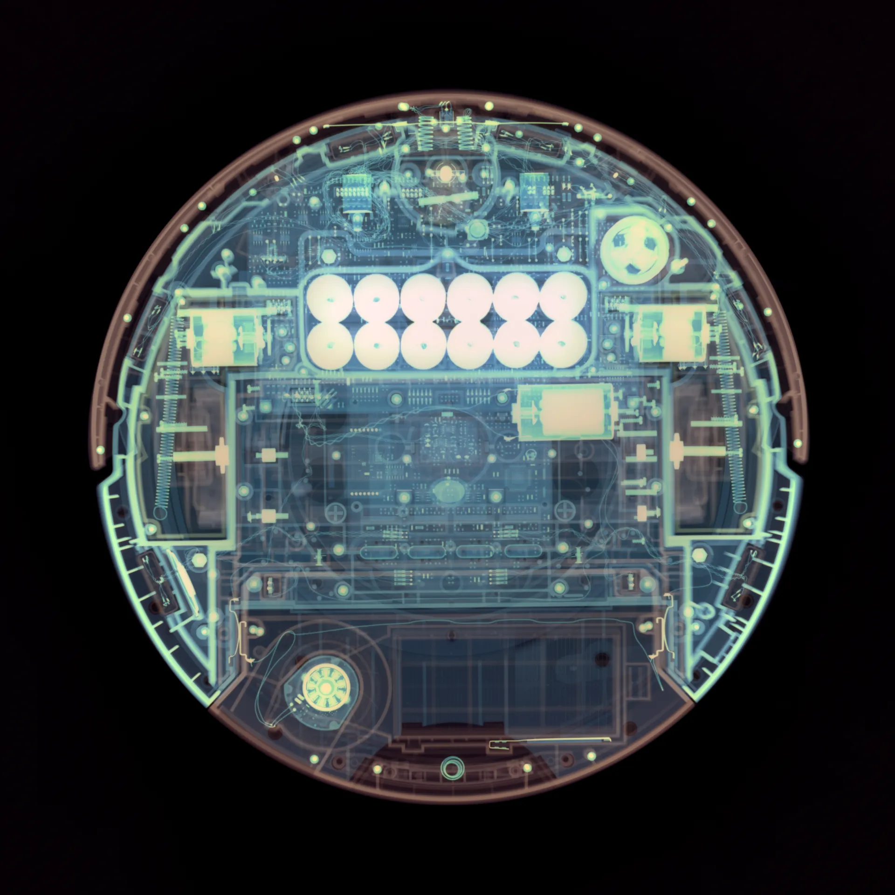

# Technical Ops

<table>
<tr>
<td align="center"> Near infrared</td>
<td align="center"> X-ray</td>
</tr>
</table>

A Technical transform makes no claim about how the scene looked and expresses no taste. That is the whole definition, and it covers two things that look different and are the same underneath.

## Mechanics

Ops that change how you look at the data without changing what the data claims:

0. **Orientation** — the EXIF tag 274 code, recorded at ingest, applied to the *output* at display. The stored plane stays exactly as captured; the camera's claim about which way is up is honoured without rotating a single sample.
1. **Crop** — a rectangle on the frame. Which samples are shown, not what they mean.
2. **The stated sensitivity** — the one scalar inside the characterization that says what the counts are, in reflectance or radiance. It is Technical because it is part of the measurement, not applied on top of it. See [Absolute](absolute.md#sensitivity-is-the-load-bearing-field).

None of these alters a value's claim. Rotate the frame and the specular is still the same specular. That is the property that makes them Technical.

## Instrumentation

Ops that remap data outside human perception into the visible so it can be inspected: near-infrared for vegetation health, X-ray for density, a satellite band for moisture, a medical band for tissue contrast. The hue on screen is a **legend**, not a look. Nobody claims the leaf was that red; the red says "high NIR reflectance here," the way a contour line says "this height."

These are Technical because they express no preference. An artist may make something striking with the same mapping and that is a Creative use of a Technical op — the op is still an instrument reading. What makes it Creative would be choosing the mapping *because* it looks good, and then the file should say so.

## The line against Creative

One question decides it: **does the op alter the claimed value, for taste?**

- Orientation: no. Technical.
- Crop: no. Technical.
- The sensitivity scalar: it *defines* the claimed value. Technical.
- An NIR remap: it replaces the value's meaning with a documented mapping, and prefers nothing. Technical.
- A second exposure scalar to make the image pleasing: yes. [Creative](creative.md).
- White balance: yes, and it gets objects wrong. Creative.
- A curve: yes. Creative.

## A sharpening of the definition

The current vsf doc defines Technical as "hue-free mechanics (a scalar exposure)." Two things about that:

0. An NIR false-colour is not hue-free, and it is plainly Technical. "Hue-free" was describing the mechanics case and missed the instrumentation case. The definition above covers both.
1. "A scalar exposure" is Technical only when it is *the* scalar — the sensitivity inside the characterization. A second one on top is Creative by the rule in [creative.md](creative.md#the-rule-for-a-second-scalar). The current doc's example is right for the first and misleading for the second.

**Proposed, 2026-09-22:** the class doc reads "makes no claim about how the scene looked and expresses no taste — value-preserving mechanics, and instrument remaps." Same four values, same fail-loud vocabulary, one sentence changed.

## How they are recorded

As `view_transform` ops with `class = technical`. opsin writes `orientation` and `crop`; a remap would be a named op carrying its mapping as `params`. The sensitivity scalar is the exception — it is not an op, it is a field on the characterization entry, because it is part of the measurement rather than a layer over it.
